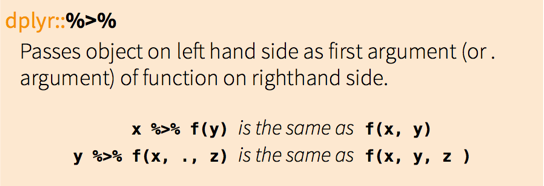
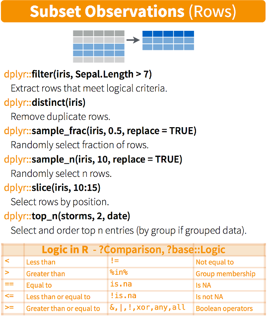

# Data wrangling? No problem, let's talk about DPLYR package!
24.06.2015, Oslo useR! Group, Dmitrijs Cudihins

## Who am I

Background

* 5 month experience with R
* Currently taking Data Science Course/ Specialisation on Coursera
* I use R for a personal project

Job

* MS Dynamics CRM consultant at AITC ([aitc.no](http://www.aitc.no))

## Agenda

This is meant to be an introduction to dplyr

* dplyr basics
* get into a little bit of programming with dplyr
* tips and tricks
* benchmarking comparison

Github: <https://github.com/dclux/dsc-oslor-dplyr>

## Cheatsheet

You might also find Rstudio's [Data Wrangling Cheat Sheet](www.rstudio.com/wp-content/uploads/2015/02/data-wrangling-cheatsheet.pdf) featuring dplyr useful. 

This is also where I borrowed some of the material used in this presentation.

Source: <http://www.rstudio.com/resources/cheatsheets/>

## Intro to Split - Apply

Data analysis involves the procedure of splitting the data set based on a grouping variable and then applying a function to each of the groups (split-apply)

*Demo: Calculate the median values for a few parameters for cars with different numbers of cylinders.*

```r
# Introduction to Split-Apply using base and dplyr
#
# Calculate the mean values for a few parameters for movies in different years.
#
# movies is a data frame in ggplo2 packages with 58788 observations.
```

```r
data(movies)
data = movies
data$year = factor(data$year)

# Preview the dataset
head(data)

# Global configuration
column.names = c("rating", "votes", "length")
```

```r
# Select only required columns
data.base = data[ , colnames(data) %in% column.names]

# Split the data on the number of cylinders
data.base.split = split(data.base, data$year)

# Apply function of interest to all columns in our dataset
data.base.results = sapply(data.base.split, function(x) apply(x, 2, mean))
data.base.results = t(data.base.results)
head(data.base.results)
```

```r
# Split-Apply using dplyr
data %>% group_by(year) %>% select(one_of(column.names)) %>% summarise_each(funs(mean))
```

## base vs dplyr

`base`


`dplyr`


## dplyr::%>%

*%>%* or the pipe operator is simply *then*

```r
data %>% group_by(cyl) %>% select(one_of(column.names)) %>% summarise_each(funs(median))
```



## dplyr::tbl_df

`tbl_df` which is a local data frame and mostly behaves like the classical `data.frame` but is more convenient for working with large data.

The main advantage to over a regular data frame is the printing: tbl objects only print a few rows and all the columns that fit on one screen and avoid accidental print of a full data set to the screen.

```
> tbl_df(movies)
Source: local data frame [58,788 x 24]

                      title year length budget rating votes   r1   r2  r3   r4   r5
1                         $ 1971    121     NA    6.4   348  4.5  4.5 4.5  4.5 14.5
2         $1000 a Touchdown 1939     71     NA    6.0    20  0.0 14.5 4.5 24.5 14.5
3    $21 a Day Once a Month 1941      7     NA    8.2     5  0.0  0.0 0.0  0.0  0.0
4                   $40,000 1996     70     NA    8.2     6 14.5  0.0 0.0  0.0  0.0
5  $50,000 Climax Show, The 1975     71     NA    3.4    17 24.5  4.5 0.0 14.5 14.5
6                     $pent 2000     91     NA    4.3    45  4.5  4.5 4.5 14.5 14.5
7                   $windle 2002     93     NA    5.3   200  4.5  0.0 4.5  4.5 24.5
8                      '15' 2002     25     NA    6.7    24  4.5  4.5 4.5  4.5  4.5
9                       '38 1987     97     NA    6.6    18  4.5  4.5 4.5  0.0  0.0
10                  '49-'17 1917     61     NA    6.0    51  4.5  0.0 4.5  4.5  4.5
..                      ...  ...    ...    ...    ...   ...  ...  ... ...  ...  ...
Variables not shown: r6 (dbl), r7 (dbl), r8 (dbl), r9 (dbl), r10 (dbl), mpaa (fctr), Action (int), Animation (int), Comedy (int), Drama (int), Documentary (int), Romance (int), Short (int)
```

## dplyr functions

The most common dplyr functions also referred to as verbs are as follows:

* `filter()` and `slice()`
* `arrange()`
* `select()` and `rename()`
* `mutate()` and `transmute()`
* `summarise()`
* `group_by()`


## Data exploration

`glimpse` is an analogue of `str` and tries to show you more of the data.


```
> str(movies)
'data.frame':    58788 obs. of  24 variables:
 $ title      : chr  "$" "$1000 a Touchdown" "$21 a Day Once a Month" "$40,000" ...
 $ year       : int  1971 1939 1941 1996 1975 2000 2002 2002 1987 1917 ...
 $ length     : int  121 71 7 70 71 91 93 25 97 61 ...
 $ budget     : int  NA NA NA NA NA NA NA NA NA NA ...
 $ rating     : num  6.4 6 8.2 8.2 3.4 4.3 5.3 6.7 6.6 6 ...
 $ votes      : int  348 20 5 6 17 45 200 24 18 51 ...
 $ r1         : num  4.5 0 0 14.5 24.5 4.5 4.5 4.5 4.5 4.5 ...
 $ r2         : num  4.5 14.5 0 0 4.5 4.5 0 4.5 4.5 0 ...
 $ r3         : num  4.5 4.5 0 0 0 4.5 4.5 4.5 4.5 4.5 ...
 $ r4         : num  4.5 24.5 0 0 14.5 14.5 4.5 4.5 0 4.5 ...
 $ r5         : num  14.5 14.5 0 0 14.5 14.5 24.5 4.5 0 4.5 ...
 $ r6         : num  24.5 14.5 24.5 0 4.5 14.5 24.5 14.5 0 44.5 ...
 $ r7         : num  24.5 14.5 0 0 0 4.5 14.5 14.5 34.5 14.5 ...
 $ r8         : num  14.5 4.5 44.5 0 0 4.5 4.5 14.5 14.5 4.5 ...
 $ r9         : num  4.5 4.5 24.5 34.5 0 14.5 4.5 4.5 4.5 4.5 ...
 $ r10        : num  4.5 14.5 24.5 45.5 24.5 14.5 14.5 14.5 24.5 4.5 ...
 $ mpaa       : Factor w/ 5 levels "","NC-17","PG",..: 1 1 1 1 1 1 5 1 1 1 ...
 $ Action     : int  0 0 0 0 0 0 1 0 0 0 ...
 $ Animation  : int  0 0 1 0 0 0 0 0 0 0 ...
 $ Comedy     : int  1 1 0 1 0 0 0 0 0 0 ...
 $ Drama      : int  1 0 0 0 0 1 1 0 1 0 ...
 $ Documentary: int  0 0 0 0 0 0 0 1 0 0 ...
 $ Romance    : int  0 0 0 0 0 0 0 0 0 0 ...
 $ Short      : int  0 0 1 0 0 0 0 1 0 0 ...
```

```
> glimpse(movies)
Observations: 58788
Variables:
$ title       (chr) "$", "$1000 a Touchdown", "$21 a Day Once a Month", "$...
$ year        (int) 1971, 1939, 1941, 1996, 1975, 2000, 2002, 2002, 1987, ...
$ length      (int) 121, 71, 7, 70, 71, 91, 93, 25, 97, 61, 99, 96, 10, 10...
$ budget      (int) NA, NA, NA, NA, NA, NA, NA, NA, NA, NA, NA, NA, NA, NA...
$ rating      (dbl) 6.4, 6.0, 8.2, 8.2, 3.4, 4.3, 5.3, 6.7, 6.6, 6.0, 5.4,...
$ votes       (int) 348, 20, 5, 6, 17, 45, 200, 24, 18, 51, 23, 53, 44, 11...
$ r1          (dbl) 4.5, 0.0, 0.0, 14.5, 24.5, 4.5, 4.5, 4.5, 4.5, 4.5, 4....
$ r2          (dbl) 4.5, 14.5, 0.0, 0.0, 4.5, 4.5, 0.0, 4.5, 4.5, 0.0, 0.0...
$ r3          (dbl) 4.5, 4.5, 0.0, 0.0, 0.0, 4.5, 4.5, 4.5, 4.5, 4.5, 4.5,...
$ r4          (dbl) 4.5, 24.5, 0.0, 0.0, 14.5, 14.5, 4.5, 4.5, 0.0, 4.5, 1...
$ r5          (dbl) 14.5, 14.5, 0.0, 0.0, 14.5, 14.5, 24.5, 4.5, 0.0, 4.5,...
$ r6          (dbl) 24.5, 14.5, 24.5, 0.0, 4.5, 14.5, 24.5, 14.5, 0.0, 44....
$ r7          (dbl) 24.5, 14.5, 0.0, 0.0, 0.0, 4.5, 14.5, 14.5, 34.5, 14.5...
$ r8          (dbl) 14.5, 4.5, 44.5, 0.0, 0.0, 4.5, 4.5, 14.5, 14.5, 4.5, ...
$ r9          (dbl) 4.5, 4.5, 24.5, 34.5, 0.0, 14.5, 4.5, 4.5, 4.5, 4.5, 1...
$ r10         (dbl) 4.5, 14.5, 24.5, 45.5, 24.5, 14.5, 14.5, 14.5, 24.5, 4...
$ mpaa        (fctr) , , , , , , R, , , , , , , , PG-13, PG-13, , , , , , ...
$ Action      (int) 0, 0, 0, 0, 0, 0, 1, 0, 0, 0, 0, 0, 0, 0, 1, 1, 0, 0, ...
$ Animation   (int) 0, 0, 1, 0, 0, 0, 0, 0, 0, 0, 0, 0, 0, 0, 0, 0, 0, 0, ...
$ Comedy      (int) 1, 1, 0, 1, 0, 0, 0, 0, 0, 0, 0, 0, 1, 0, 1, 1, 0, 0, ...
$ Drama       (int) 1, 0, 0, 0, 0, 1, 1, 0, 1, 0, 1, 0, 0, 0, 0, 0, 1, 0, ...
$ Documentary (int) 0, 0, 0, 0, 0, 0, 0, 1, 0, 0, 0, 0, 0, 0, 0, 0, 0, 1, ...
$ Romance     (int) 0, 0, 0, 0, 0, 0, 0, 0, 0, 0, 0, 0, 0, 0, 0, 0, 0, 0, ...
$ Short       (int) 0, 0, 1, 0, 0, 0, 0, 1, 0, 0, 0, 0, 1, 1, 0, 0, 0, 1, ...
```

## Subset observations



### Filter

`filter()` allows you to select a subset of the rows of a data frame matching some criterias or conditions.

